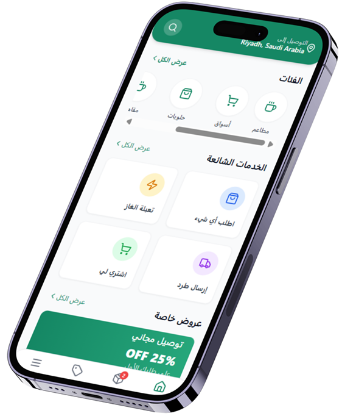
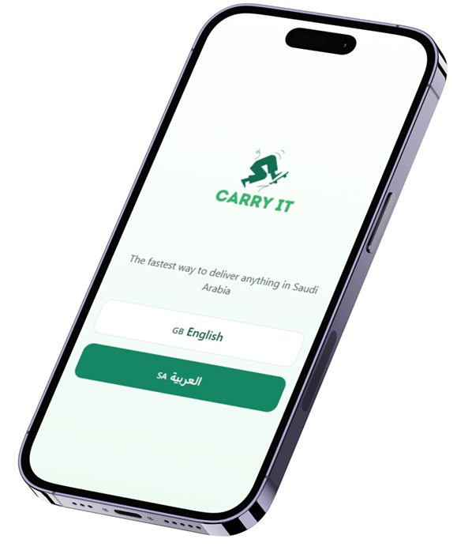
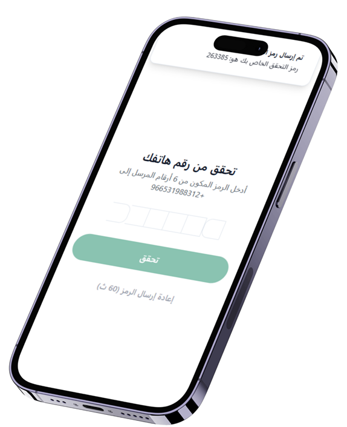
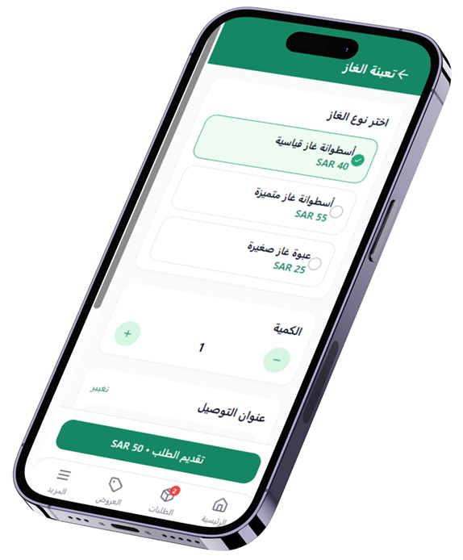
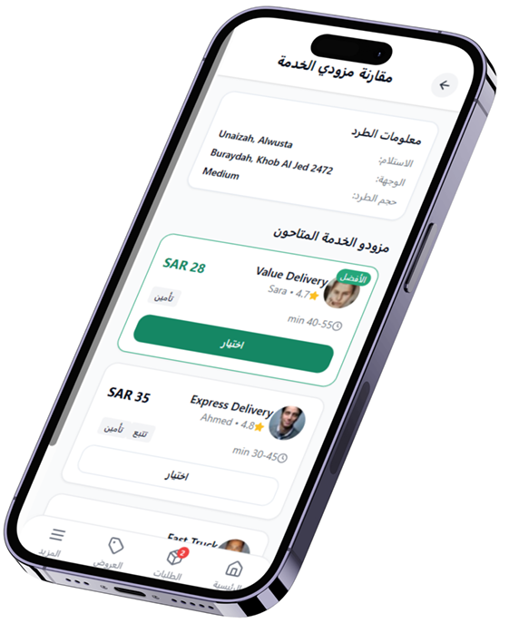
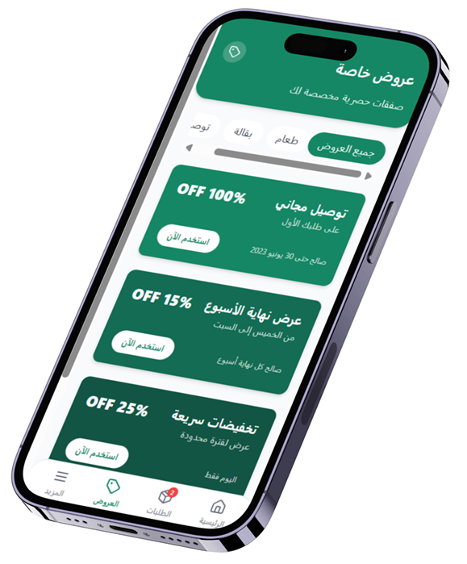
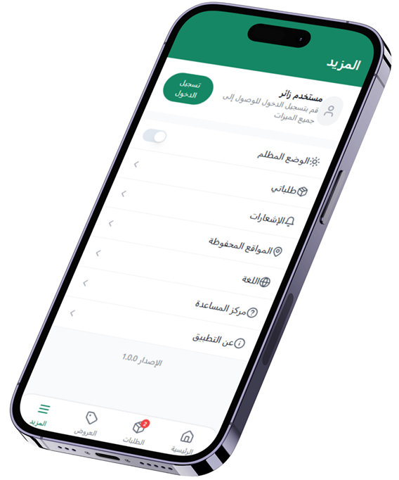

````markdown id="bph2i5"
# 🚚 Carry It - Smart Delivery Platform



## 🎓 Graduation Project

Carry It is a Graduation Project developed for the College of Computer at Qassim University, Department of Information Technology. :contentReference[oaicite:0]{index=0}

The project aims to improve the delivery experience by providing:
- Real-time shipment tracking
- Delivery provider comparison
- Transparent pricing
- Modern and user-friendly interfaces

Carry It focuses on solving common problems in traditional delivery applications such as:
- Lack of price transparency
- Poor shipment tracking
- Complex interfaces
- Limited delivery options

---

# ✨ Features

- 📍 Real-time shipment tracking
- 💰 Price comparison between delivery providers
- 🌐 Arabic & English language support
- 🔐 OTP authentication system
- ⭐ Driver/provider rating system
- 🎁 Offers & promotions section
- 📱 Responsive modern UI
- ⚡ Fast application performance

---

# 🛠️ Technologies Used

## Frontend
- React
- TypeScript
- Tailwind CSS
- Vite

## Backend (Planned)
- Node.js
- Firebase

## Other Tools
- Git & GitHub
- Google Maps API
- Context API

---

# 🧠 Provider Comparison Algorithm

The application uses a smart provider scoring system to recommend the best shipping provider.

```text
score = (price * 0.5) + (eta * 0.3) - (rating * 10)
````

Providers are sorted based on the lowest score to offer users the best delivery option.

---

# 📸 Application Screenshots

## 🌍 Welcome Screen with Language Selection



---

## 🔐 OTP Verification Screen



---

## 🏠 Main Dashboard with Categorized Services


---

## ⛽ Gas Delivery Order Screen



---

## 🚚 Service Providers Comparison Screen



---

## 🎁 Offers and Promotions Screen



---

## ⚙️ More Options / Settings Screen



---

# ⚙️ Installation & Setup

Clone the repository:

```bash id="m1quz3"
git clone https://github.com/hmonaweribrahim-crypto/carry-it.git
```

Install dependencies:

```bash id="lm1sm4"
npm install
```

Run the development server:

```bash id="c0k6o9"
npm run dev
```

Build for production:

```bash id="x5j6bz"
npm run build
```

---

# 📊 Project Results

* ⏱️ Average app load time: **1.7 seconds**
* 😊 User satisfaction score: **9/10**
* 🧪 Tested by: **12 users**
* 📱 Responsive across mobile, tablet, and desktop devices

---

# 🚧 Current Limitations

* Mocked APIs are currently used
* No live provider integrations yet
* Limited testing for network edge cases
* Provider dashboard not implemented

---

# 🚀 Future Improvements

* AI-based delivery recommendations
* Real provider API integrations
* Push notifications
* Analytics dashboard
* Advanced driver matching system
* Regional & international expansion

---

# 👨‍💻 Team Members
* Hamed Mnawer Ibrahem Alharbi
* Abdulaziz Abdullah Abdulaziz Almatroudi
* Emad Jamaan Mohammad Aljumah
* Ibrahim Suliman Ibrahim Aldubayyan
* Yazeed Yousif Mohammad Alshomar

### Supervisor

Dr. Waleed Albattah


---

# ⭐ Support

If you like this project, don't forget to leave a ⭐ on the repository.

```
```
